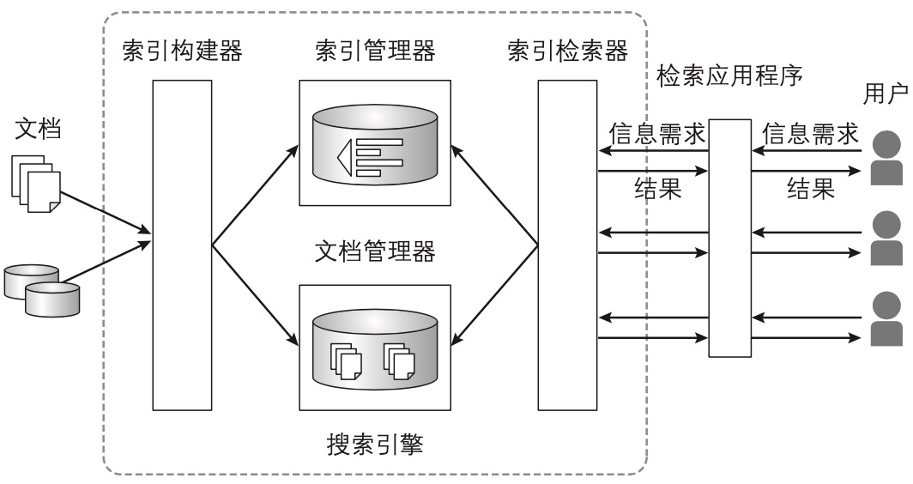
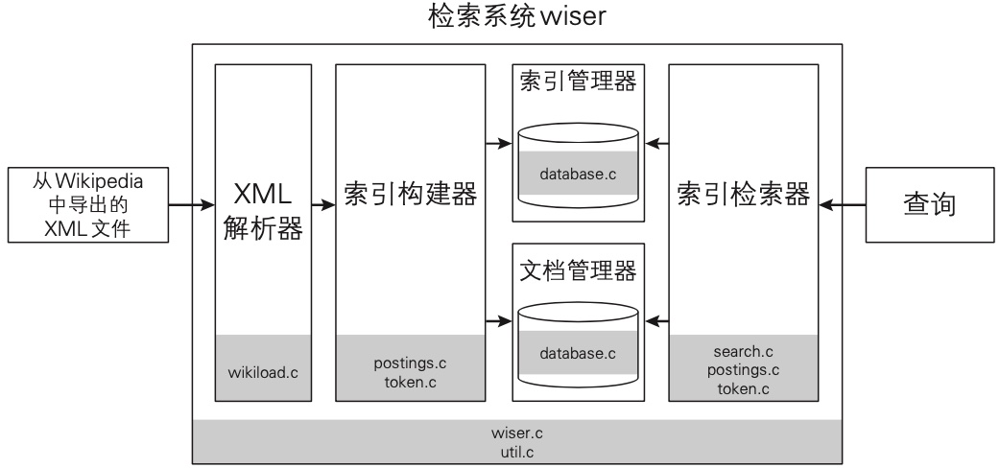

## 构成搜索引擎的组件
- 索引管理器(Index Manager)
- 索引检索器(Index Searcher)
- 索引构建器(Indexer)
- 文档管理器(Document Manager)





- 所有处理过程都是从 `wiser.go` 开始的。`wiser.go` 会先去解析命令行的参数，然后根据参数调整调用构建索引或执行检索的处理过程。
- `XML 解析器` 是由 `wordload.go` 实现的。负责从 `XML` 文件中提取文本数据形成文档，并将文档存到数据库中。
- `索引构建器` 是由 `postings.go` 和 `token.go` 实现的，负责将文本文档转换成索引。
- `索引检索器` 是由 `search.go` 、 `postings.go` 和 `token.go` 共同实现的，负责使用倒排索引进行检索处理。
- `database.go` 负责使用数据库管理文档数据和索引。
- `util.go` 负责提供在所有模块中都会用到的通用处理。

## 准备用于检索的文档

- 根据指定的路径打开 XML 文件
- 获取 <title> 标签中的内容作为文档的标题
- 获取 <text> 标签中的内容作为文档的正文
- 将标题和正文传给索引构建器

反复执行上述处理过程中的后三步...

## 构建倒排索引的步骤

1. 从作为检索对象的文件中提取出词元及其出现的位置
2. 对于每个词元，将其所在文档的引用信息(文档编号)和出现在文档中的位置保存起来

### 提取词元
提取词元使用N-gram或词素解析的方法将句子分隔成词元的序列。

首先在字符串的编码上，将 UTF-8 转换成 UTF-32。UTF-32 是一种以4字节(32bit)的数值为单位表示Unicode字符的编码方式。

由于Unicode的字符与表示该字符的数值是一一对应的，所以在UTF-32中，由 N-gram 分割而成的词元所含有的字节数就变成固定的了。

这样就简化了程序上的处理过程，但是增加了处理速度和内存使用量。

在文件 `token.go` 中的函数 `NgramNext()` 负责将句子分隔成词元

### 为每个词元创建倒排列表

- 文档级别的倒排列表：关联到词元上的文档编号的集合
- 单词级别的倒排列表：由文档编号和词元在文档中出现的位置构成的二元组的集合
- 倒排文件：由所有词元的倒排列表汇聚而成的集合称为倒排文件。

使用单词级别的倒排列表可以进行快速的短语检索。

## 开始构建倒排索引

### 在存储器上创建倒排索引

每个用户都可以自定义自己的单词表，所以在内存上为所有文档构建倒排索引并不现实。
因此，使用硬盘或SSD等二级存储器来构建倒排索引

这里我们使用基于归并的构建方法，对于某个文档集合。

- 现在内存上为其建立一个较小的倒排索引，
- 然后将这个较小的倒排索引和存储器上的倒排索引合并，
- 通过返回进行这两步操作，最终就能一点点地在存储器上构建出较大的倒排索引了。

我们将在内存上构建的临时倒排索引称为“小倒排索引”。

### 倒排列表和倒排文件的数据结构

在 wiser 中，**倒排列表**是使用结构体 `postings_list` 来管理的。

```go
// 倒排列表（以文档编号和位置信息为元素的链表结构）
type PostingsList struct {
	DocumentID     int           // 文档编号
	Positions      []int         // 位置信息的数组 TODO: 不知道是啥类型
	PositionsCount int           // 位置信息的条数
	Next           *PostingsList // 指向下一个倒排列表
}
```

在 wiser 中，**倒排文件**是使用结构体 `inverted_index_hash` 来管理的。

```go
// 倒排索引（以词元编号为键，以倒排列表为值的关联数组）
type InvertedIndexHash struct {
	TokenID       int           // 词元编号（Token ID）
	PostingsList  *PostingsList // 指向包含该词元的倒排列表的指针
	//PostingsMap   map[int][]int
	DocsCount     int // 出现过该词元的文档数
	PostingsCount int // 该词元在所有文档中的出现次数之和
	// TODO: 将该结构体转化为哈希表 - 用于管理倒排列表的关联数组
}
```

为了将结构体当做关联数组来处理，`inverted_index_hash` 类型表示整个关联数组。

`inverted_index_value` 表示关联数组中的一个元素。

### 从源代码级别梳理索引的构建顺序

|函数名|文件名|
|---|---|
|AddDocument()|logic/wiser.go|
|GetTokenId()|db/document.go|
|IsIgnoredChar()|util/utils.go|
|NgramNext()|util/utils.go|
|TextToPostingsLists()|logic/token.go|
|TokenToPostingsList()|logic/token.go|

在wiser中，我们首先调用了函数 `AddDocument()`, 该函数的作用是为文档的标题和正文构建倒排索引以及用于存储文档的数据库。

在函数`AddDocument()` 内部会进行如下的操作

1. 从文档中取出词元
2. 为每个词元建立倒排列表，并更新小倒排索引
3. 每当小倒排索引增长到一定大小，就将其于存储器上的倒排索引合并到一起

#### 函数 `AddDocument()` 

```go
// 将文档添加到数据库中，建立倒排索引
// title 文档标题，为 Nil 时将会清空缓冲区
// body 文档正文
func (env *WiserEnv) AddDocument(title, body string) error {
	if len(title) > 0 && len(body) > 0 {
		// 将文档标题和正文存储到数据库中
		dao.DBAddDocument(title, body)
		// 并获取该文档对应的文档编号
		documentID := dao.DBGetDocumentID(title)

		// 为文档创建倒排列表
    // 根据文档编号和文档内容更新存储在变量env.IIBuffer中的小倒排索引
		err := env.TextToPostingsLists(documentID, body)
		if err != nil {
			return err
		}
		env.IIBufferCount++ // 用户更新倒排索引的缓冲区中的文档数
		env.IndexedCount++  // 建立了索引的文档数
		fmt.Printf("count: %d title: %s\n", env.IndexedCount, title)
	}
  
	// 存储在缓冲区中的文档数量达到了指定的阈值时，更新存储器上的倒排索引
	// 当 title 为空时，或者当已构建出小倒排索引的文档数量达到了阈值时，就合并索引
	// 另外，title 为空，还标志着所有的文档都已经处理完了。
	// 阈值设定得越小，内存的使用量也就越小，但会增加堆数据库的访问次数。
	// 反过来，阅知设定得越大，内存的使用量就越大，也减少了对数据库的访问次数。
	if len(env.IIBuffer) > env.IIBufferUpdateThreshold && title == "" {
		util.PrintTimeDiff()
		// 更新所有词元对应的倒排项，合并倒排索引，
		// 并将合并后的结果写入数据库(存储器)中。
		err := env.UpdatePostingsAndFree()
		if err != nil {
			return err
		}
		util.PrintTimeDiff()
	}
	return nil
}
```

#### 函数 `TextToPostingsLists`  

```go
// 为构成文档内容的字符串建立倒排列表的集合(倒排文件)
// document id 文档编号。为0时表示要把查询的关键词作为处理对象
// text 输入的字符串
func (env *WiserEnv) TextToPostingsLists(documentId int, text string) error {
	// 分隔 N-gram 词元
	runeBody := []rune(text)
	start := 0
	for {
    // 每次从字符串中取出长度为 N-gram 的词元
		tokenLen, position := util.NgramNext(runeBody, &start, env.TokenLen)
		if tokenLen == 0 {
			break
		}
		if tokenLen < env.TokenLen {
			continue
		}
		// 将词元添加到倒排列表中
		token := string(runeBody[position : position+env.TokenLen])
		err := env.TokenToPostingsList(documentId, token, start)
		if err != nil {
			return err
		}
	}
  // 当循环结束后，传入的 text 构成的倒排索引就构建好了。
	return nil
}
```

####  函数`NgramNext()`

```go
// 将输入的字符串分隔为N-gram
// ustr 输入的字符串
// n N-gram 中 N 的取值。建议将其设为大于 1 的值
// start 词元的起始位置
// 返回分隔出来的词元的长度
func NgramNext(ustr []rune, start *int, n int) (int, int) {
	totalLen := len(ustr)
	// 读取时跳过文本开头的空格等字符
	for {
		if *start >= totalLen {
			break
		}
		// 当不是空白字符的时候就跳出循环
		if !IsIgnoredChar(ustr[*start]) {
			break
		}
		*start++
	}
	tokenLen := 0
	position := *start

	// 不断取出最多包含n个字符的词元，直到遇到不属于索引对象的字符或到达了字符串的尾部
	for {
		if *start >= totalLen {
			break
		}
		if tokenLen >= n {
			break
		}
    // 当是空白字符的时候就结束索引
		if IsIgnoredChar(ustr[*start]) {
			break
		}
		*start++
		tokenLen++
	}

	if tokenLen >= n {
		*start = position + 1
	}

	return tokenLen, position
}
```

#### 函数`TokenToPostingsList`

```go
// 为传入的词元创建倒排列表
// document id 文档编号
// token 词元
// start 词元出现的位置
func (env *WiserEnv) TokenToPostingsList(id int, token string, start int) error {
	// 获取词元对应的编号
	tokenID, _ := DBGetTokenID(token, id)
	// 看是否能找到已 token id 为键的倒排列表
	IIEntry, ok := env.IIBuffer[tokenID]
  // 小倒排索引中不存在关联到该词元上的倒排列表
	if !ok {
    // 先生成一个空的小倒排索引
		IIEntry = InvertedIndex{
			PostingsMap:   map[int][]int{},
			PostingsCount: 0,
		}
    // 将该词元添加到新建的小倒排索引中
		env.IIBuffer[tokenID] = IIEntry
	}
  // 看小倒排索引中是否存在关联到该词元上的倒排列表
	_, ok = IIEntry.PostingsMap[id]
	if !ok {
    // 将新的倒排列表添加到小倒排索引中
		IIEntry.PostingsMap[id] = []int{}
	}
	// 存储位置信息，关联到词元上的倒排列表
	IIEntry.PostingsMap[id] = append(IIEntry.PostingsMap[id], start)
  // 该倒排列表中词元的的出现次数增加1
	IIEntry.PostingsCount++
	return nil
}
```

#### 函数`UpdatePostingsAndFree()` 

```go
// 将内存上（小倒排索引中）的倒排列表与存储器上的倒排列表合并后存储到数据库中
// env 存储着应用程序运行环境的结构体
// p 含有倒排列表的倒排索引中的索引项
func (env *WiserEnv) UpdatePostingsAndFree() error {
	for tokenID, IIEntry := range env.IIBuffer {
    // 从数据库中取出作为合并源的倒排列表
		oldPostings, err := FetchPostings(tokenID)
		if err != nil {
			return err
		}
    // 如果数据库中存在作为合并源的倒排列表
		if oldPostings != nil {
      // 就将该倒排列表和要合并进来的倒排列表合并在一起
			IIEntry.PostingsMap = util.MergePostings(oldPostings, IIEntry.PostingsMap)
		}
    // 将内存上的倒排列表转换成了字节序列
		buf, err := util.EncodePostings(IIEntry.PostingsMap)
		if err != nil {
			return err
		}
    // 将转换后的字节序列存储到了数据库中
		dao.UpdatePostings(tokenID, len(IIEntry.PostingsMap), buf)
	}
	env.IIBuffer = map[int]InvertedIndex{}
	fmt.Println("Index flushed")
	return nil
}
```

#### 函数`MergePostings` 

```go
// 合并内存上的两个倒排索引
// 获取将两个倒排列表合并后得到的倒排列表
func MergePostings(pa, pb map[int][]int) map[int][]int {
	mergePostings := map[int][]int{}
	allKeysSet := NewSet()

	for key := range pa {
		allKeysSet.Add(key)
	}
	for key := range pb {
		allKeysSet.Add(key)
	}

	for _, key := range allKeysSet.List() {
		subSet := NewSet()
		al, ok := pa[key]
		if ok {
			subSet.Add(al...)
		}
		bl, ok := pb[key]
		if ok {
			subSet.Add(bl...)
		}
		mergePostings[key] = subSet.SortList()
	}
	return mergePostings
}
```

### 总结

至此就梳理完了以函数 `AddDocument()` 为入口的构建倒排索引的处理流程。

1. 从文档中取出词元。
2. 为每个词元创建倒排列表并将该倒排列表添加到小倒排索引中。
3. 每当小倒排索引增长到一定大小，就将其与存储器上的倒排索引合并到一起。

 

## 使用倒排索引

### 检索处理的大致流程

wiser 只支持 AND 检索，所以在下文都假设进行的是 AND 检索

1. 将查询分割为词元
2. 将分割出的各个词元，按照出现过该词元的文档数量进行*升序排列*
3. 获取各个词元的倒排列表，并从中取出文档编号和该词元在文档中出现位置的列表
4. 如果所有词元都出现在同一文档中，并且这些词元的出现位置都是相邻的，那么就将该文档添加到检索结果中
5. 计算已添加到检索结果中的各文档与查询的匹配度(在wiser中使用TF-IDF值作为匹配度)
6. 将检索结果按照匹配度的降序排列
7. 从经过排序的检索结果中取出排在前面的若干个文档作为检索结果返回

步骤2中升序排列，可以尽早缩小检索结果的范围，就可以减少在步骤4中进行比较处理的次数。

### 使用倒排索引进行检索

#### 从源码级别梳理检索处理的流程

以检索模式启动 wiser 后，函数 `search()`  就会被调用

```go

```


